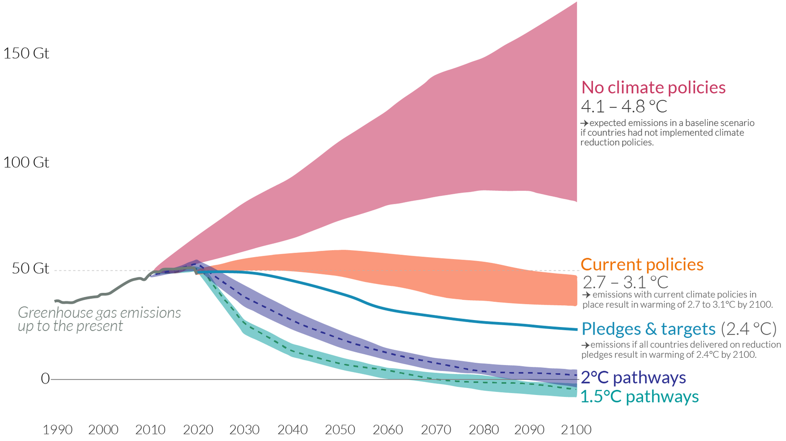
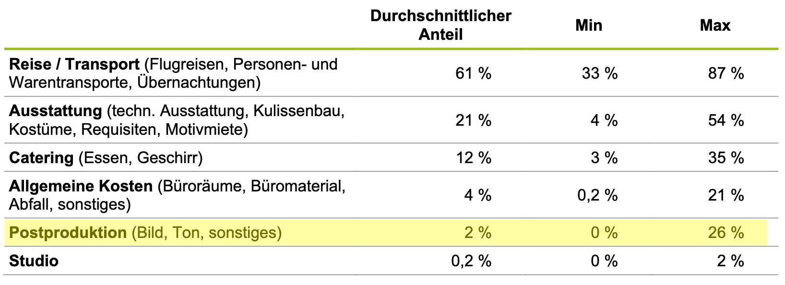
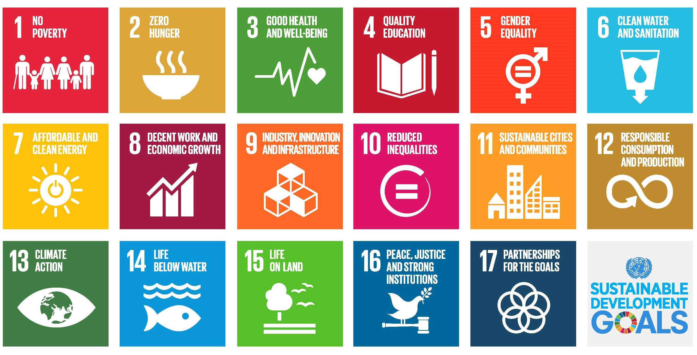

name: inverse
layout: true
class: center, middle, inverse
---

.center[]

.center[]

#### 26.09.2023 | Filmuniversität Babelsberg KONRAD WOLF 

???
.task[COMMENT:]  

* Wie kam es zum Clean Film IT Lab?
    * Treffen verschiedener Akteure Medienstadt
    * Nachhaltigkeit als Thema identifiziert
    * Peter Effenberg und ich
        * MTH Konferenz
        * Clean IT Konferenz HPI 
* Wissen und Aktivitäten für die Branche

---
layout: false

.header[Das Clean Film IT Lab]

## Die Ergebnisse des Labs

--

1. Impulse für die Branche

--

2. White Paper der Media Tech Hub Konferenz

--
3. Horizon Forschungsantrag 
   
    * Cultural and creative industries for a sustainable climate transition
    * *MovieTwin - Ein Ökosystem Für Die Nachhaltige Filmproduktion* (AT)
    * Grundsätzliche Probleme der Branche?

--
4. HPI Startup Bootcamp 
    * *Sustainable solutions in movie production*
    * Welches konkrete Problem soll gelöst werden?
  
---
.header[Das Clean Film IT Lab]

## Agenda

* Vorstellungen & Intro    
* Teil 1 – Einleitung & Überblick  
* Teil 2 – Reality-Check  
* Teil 3 – Kontext & Ausblick  
* Teil 4 – Diskussion *Probleme in der Praxis*  
* Teil 5 – Die Nächsten Schritte  
* Diskussionsrunde  
* Get-Together  

---
template:inverse

# Vorstellungsrunde

---
template:inverse

# Einleitung & Überblick

???
.task[COMMENT:]  

* Begriffsklärung
    * Grün
    * Ökologischer Fußabdruck
    * Clean
    * Co2e Emission
    * Green Washing
* Filmproduktion
    * Aktuelle Zahlen und Aktivitäten
* IT & Cloud Komponenten
    * Komponenten
    * Exemplarisches Studio
    * Exemplarische Schätzungen
    * Ausblick Technologie

---
template:inverse

### Einleitung & Überblick
# *Clean? Green?*

???
.task[COMMENT:]  

... etwas als grün oder clean zu bezeichnen?

Mit grün sind zusammenfassend..

???
.task[COMMENT:]  

Heute soll es um grüne Zukunft gehen, Stichworte die eine KI beispielsweise wie hier...

---
layout: false

.center[]

<!-- .footnote[[Lena Gieseke. 2023. Dall-E 2]] -->

???
.task[COMMENT:]  

...zu sehen visualisiert.

---
.header[Begriffsklärung]

## Green 

* Verfahren oder Produkte mit geringer Umweltbelastung 

.footnote[[European Commission. 2023. [*Green Public Procurement*](https://green-business.ec.europa.eu/green-public-procurement_en). Energy, Climate change, Environment: Green Business.] [Producers Guild of America Foundation. 2023. [*Green Production Guide: Toolkit*](https://greenproductionguide.com/).]]

???
.task[COMMENT:]  

...Verfahren oder Produkte gemeint, die nicht oder nur gering unsere Umwelt, die Natur, das Ökosystem unseres Planeten belasten.

Zu grünen Filmproduktionen, konkretisiert die Producers Guild of America... 

--

> Zu den Prinzipien einer umweltfreundlichen Produktion gehören die Einsparung von Kraftstoff und Energie, die Vermeidung von Giftstoffen und Verschmutzung, die Einsparung von Wasser, die Reduzierung von Plastik und die Vermeidung von Deponieabfällen.

---
.header[Begriffsklärung]

## Ökologischer Fußabdruck 

--

* Indikator für ökologische Nachhaltigkeit

???
.task[COMMENT:]  

* Kurze Beschreibung, aber

--

> Wie viel Land umd Wasser brauchen wir, um unseren Lebensstil zu ermöglichen?

.footnote[[Sustainability Illustrated. 2013. [*Ecological footprint: Do we fit on our planet?*](https://www.youtube.com/watch?v=g_aguo7V0Q4), Global Footprint Network. 2023. [*Ökologischer Fußabdruck*](https://data.footprintnetwork.org/#/countryTrends?cn=79&type=earth)]]

--

* Ressourcen für die Produktion, aber auch für z.B. die Entsorgung von Abfällen

--

> Global verbrauchen wir aktuell 1.75 Erden.

--

* Unterschiedliche Verteilung
    * Deutschland 3.25
    * Kongo 0.48

???
.task[COMMENT:]  

Der Begriff clean kommt unter anderem von...

---
.header[Begriffsklärung]

## Clean

* Saubere Energie, insbesondere aus erneuerbaren, nicht-fossilen Energiequellen

.footnote[[Natural Resources Defense Council. 2022. *Renewable Energy: The Clean Facts*. Data, Reports & Resources.]  
[clean-IT Forum. 2023. [*Sustainable Digitalization*](https://open.hpi.de/channels/clean-it-forum).]]

???
.task[COMMENT:]  

...clean Energie unter der man vor allem Energie aus erneuerbaren, nicht-fossilen Energiequellen wie Wind, Sonne, Wasserkraft und Erdwärme versteht.

Clean als Begriff hat sich auch dahingehend weiterentwickelt, ...

-----------------------
* Einige Definitionen erweitern diese Definition um Kraftstoffquellen wie Biokraftstoffe (Ethanol usw.), Wasserstoff und Kernenergie, aber diese sind eher umstritten. Der Begriff wird häufig mit anderen Begriffen wie *emissionsfrei, kohlenstoffneutral, erneuerbar, nachhaltig und klimaneutral* in Verbindung gebracht. Der Begriff "sauber" ist nicht auf die Emission von Kohlenstoff beschränkt, sondern kann auch andere Ressourcen wie Wasser, Abfall und Verschmutzung einschließen [Energie und Wasser - Themen - IEA].
* Erneuerbare Energie, oft auch als [saubere Energie] bezeichnet, stammt aus natürlichen Quellen oder Prozessen, die sich ständig erneuern... Nicht erneuerbare oder "schmutzige" Energie umfasst fossile Brennstoffe wie [Öl, Gas und Kohle]. Nicht-erneuerbare Energiequellen sind nur in begrenzten Mengen verfügbar.
* Clean IT ist ein Projekt der Europäischen Union zur Bekämpfung illegaler Inhalte im Internet. 
--
* IT mit geringem Energieverbrauch

???
.task[COMMENT:]  

... einen geringen Energieverbrauch zu beschreiben. In Kombination mit IT, also Clean IT, versteht man Systeme, die explizit so entwickelt werden, dass sie besonders energiesparend sind. Unsere Kolleg:innen vom HPI haben hier das Prinzip...

--

> Sustainability by Design.

???
.task[COMMENT:]  

...formuliert. 

Neben all diesen Begriffen möchte ich auch uns ein weiteres mal eines der bzw. das Hauptproblem im Kontext von Umweltverschmutzung in Erinnerung rufen.

Unser akutes Problem ist...
  

---
.header[Begriffsklärung]

## Treibhausgasemissionen

.center[  [[Sustainability Illustrated]](https://www.youtube.com/watch?v=z5OYFCDOw7A)]  

Erderwärmung ist die Folge von Treibhausgasemissionen, sowie nicht-nachhaltiger Forst- und Landwirtschaft.

???
.task[COMMENT:]  

...die Erderwärmung als Folge von vor allem Treibhausgasemissionen.

----------------------------

* 70-20-Müll, 
* Anstieg der Durchschnittstemperatur der erdnahen Atmosphäre und der Meere. 
* Es handelt sich um einen anthropogenen (= menschengemachten) Klimawandel[2]:7, SPM.2, der eine Folge ist von Netto-Treibhausgasemissionen, die seit Beginn der Industrialisierung durch Nutzung von fossilen Energieressourcen sowie nicht-nachhaltiger Forst- und Landwirtschaft entstanden sind
* ein wissenschaftlicher Konsens darüber, dass die gemessene globale Erwärmung nahezu vollständig vom Menschen verursacht wird; Cook et al.: Quantifying the consensus on anthropogenic global warming in the scientific literature. In: Environmental Research Letters. Band 8, 2013, doi:10.1088/1748-9326/8/2/024024
* Kohlenstoff ist in Kohlendioxid enthalten, einem Treibhausgas, das die Wärme in der Nähe der Erde zurückhält. Es hilft der Erde, einen Teil der Wärme, die sie von der Sonne empfängt, zu speichern, damit sie nicht vollständig ins Weltall zurückfließt. Aber CO2 ist nur bis zu einem gewissen Punkt gut - jenseits dieses Punktes erwärmt sich die Erde zu stark. NASA-Forschungssatelliten wie OCO-2 und OCO-3 untersuchen, wie sich Kohlenstoff um den Planeten bewegt. https://climatekids.nasa.gov/carbon/

--

* Nutzung von fossilen Energieressourcen
* Kohlenstoffdioxid (CO2), aber auch andere Treibhausgase (CO2e)

???
.task[COMMENT:]  

Durch die Nutzung fossile Energieressourcen wird Kohlenstoffdioxid (CO2), aber auch andere Treibhausgase, freigesetzt, dass Wärme in der Atmosphäre und der Nähe der Erde zurückhält.

Das ist ein Problem.

* CO₂-Äquivalente (CO₂e) sind eine Masseinheit zur Vereinheitlichung der Klimawirkung der unterschiedlichen Treibhausgase. 

------------------

* Wichtigstes Treibhausgas bei der derzeitigen globalen Erwärmung ist Kohlenstoffdioxid (CO2), dazu kommen weitere Treibhausgase wie z. B. Methan und Distickstoffmonoxid. Die von der Messstation Mauna Loa gemessene mittlere CO2-Konzentration in der Erdatmosphäre stieg von ursprünglich etwa 280 ppm vor Beginn der Industrialisierung auf inzwischen über 410 ppm. 
* Das bedeutet, dass CO2 in der Atmosphäre die Wärme in der Nähe der Erde zurückhält. Es hilft unserem Planeten, einen Teil der Wärme, die er von der Sonne erhält, zu speichern, damit die Energie nicht vollständig ins All entweicht.

---
.header[Begriffsklärung | Treibhausgasemissionen]

## Globale Entwicklung

.center[]

.footnote[[Hannah Ritchie and Max Roser. 2017. *CO₂ and Greenhouse Gas Emissions*. OurWorldInData.org]]

???
.task[COMMENT:]  

Wir wissen alle, aber nichts schaden uns es wieder und wieder vor Augen zu führen. Wenn wir so weiter machen wie bisher, erwärmt sich die Erde um ca. 4 Grad. Wenn wir die aktuellen Pläne umsetzen liegen wir bei eine Erwärmung um die 3 Grad.

Um sich zu verdeutlichen, was das genau bedeutet, nehme ich gerne des Beispiel des Fieber-habens. Stellen Sie sich einfach mal vor, wie es Ihnen wenn sie bei 38 Grad Fieber, bei 39 Grad, bei 40 Grad.  

Unser aktuell noch nicht mal erreichtes Ziel ist es, dauerhaft zwischen 38 und 39 Grad Fieber zu haben.

Diese Erwärmung beruht auf dem Ausstoß von Treibhausgase. Sprich wir müssen dringend weniger Treibhausgase produzieren. Das ist das eines, wenn nicht das Hauptproblem.

Wo stehen wir in diesem Kontext...

--------

* Gigatonnen
* Gesamtbetrag von Kohlenstoffdioxid-Emissionen (CO2-Bilanz, Treibhausgasbilanz, CO2-Fußabdruck)

---
.header[Begriffsklärung | Treibhausgasemissionen]

## Intuitive Quantifizierung

Eine Tonne CO₂ entspricht

.footnote[[Climate Neutral Group. 2023. [*What Exactly Is 1 Tonne of CO₂?*](https://www.climateneutralgroup.com/en/news/what-exactly-is-1-tonne-of-co2-v2/)], Tapio. [*What is a ton of CO₂, and how much CO2 do we emit?*](https://www.tapio.eco/blog/what-represents-one-ton-co2-emissions/), Umweltbundesamt. 2018. [*High costs when environmental protection is neglected*](https://www.umweltbundesamt.de/en/press/pressinformation/high-costs-when-environmental-protection-is)]

--
* 1 Flug Paris - New York

--
* 0.65 Jahresverbrauch eines durchschnittlichen Haushalts

--
* 0.5 Jahresverbrauch eines Benziners, 1 Jahresverbrauch eines Elektroautos

--
* 138 Fleischgerichte, 1961 vegetarische Gerichte

--
* Schaden im Wert von 180 Euro
  
--
  
> Für die Absorption einer Tonne CO₂ müssen 50 Bäume 1 Jahr wachsen.

???
.task[COMMENT:]  

* 90 Milliard Bäume
* 1,8 Milliarden Tonnen C02
* Für das Jahr 2022 wurden Gesamt-Emissionen in Höhe von 746 Mio. t berichtet. Die Emissionen sinken um 1,9 Prozent gegenüber dem Jahr 2021.

https://de.globometer.com/kategorie/umwelt

Kugel mit einem Durchmesser von 10 m

A 3,000-mile round-trip flight (like one from Boston to London and back) emits approximately one ton of CO2 per passenger.

U.S. Environmental Protection Agency, Emission Factors for Greenhouse Gas Inventories. Accessed December 2, 2020.

And while it’s nice to know what one ton of carbon looks like, what about 35 billion tons of CO2—roughly the amount the whole human race emits every year?2 35 billion 27’ x 27’ x 27’ cubes would cover 915,224 square miles. This is enough to almost completely cover Alaska and Texas, America’s two largest states. In the continental U.S., it would cover Texas, New Mexico, Arizona, California, Nevada, Utah and a good chunk of Colorado to a depth of 27 feet—and that’s just one year of the world’s CO2 emissions.

https://climate.mit.edu/ask-mit/how-much-ton-carbon-dioxide

Eine Tonne CO₂ ist gleich viel wie...

    3300 Kilometer mit einem Benzinauto
    eine Flugstrecke von Frankfurt nach New York
    8800 Becher Kaffee
    ein Ballon mit neun Metern Durchmesser und rund 380m3 Volumen

Jedes Jahr füllt eine in der Schweiz lebende Person 14 solcher Ballone und verursacht somit rund 14 Tonnen CO₂-Äquivalente pro Jahr (inklusive graue Emissionen). Um den fortschreitenden Klimawandel eindämmen zu können, dürfte dieser Pro-Kopf-Ausstoss höchstens 0,6 Tonnen CO₂ betragen.

https://www.myclimate.org/de-ch/informieren/faq/faq-detail/wie-viel-ist-eine-tonne-co2/

Ziel: eine Tonne CO2 pro Mensch
“In der internationalen Diskussion ist jedoch ein ‘Zwei-Tonnen-Ziel’ – zwei Tonnen CO2-Äquivalent pro Person im Jahr 2050 – als weltweite Zielgröße im Gespräch”, erklärt er.

“Um ein 95-Prozent-Ziel zu realisieren und damit Treibhausgasneutralität herzustellen, wäre für Deutschland eine Pro-Kopf-Emission von einer Tonne pro Jahr in 2050 zu realisieren.” Diese Zahl bezieht sich auf den gesamten Lebensbereich, neben Verkehr auch auf Energie, Konsum und Ernährung.

---
.header[Begriffsklärung | Treibhausgasemission]

## CO2-Fußabdruck

--

* Funktionale Maßeinheit
* Gesamtbetrag von Kohlenstoffdioxid-Emissionen

.footnote[[Wikipedia. 2023. [*CO2-Bilanz*](https://de.wikipedia.org/wiki/CO2-Bilanz)]]

???
.task[COMMENT:]  

* die direkt und indirekt durch Aktivitäten verursacht wird oder während der Lebensstadien eines Produktes entstehen

--

.center[]  

---
.header[Begriffsklärung | Treibhausgasemission]

## CO2-Fußabdruck in Deutschland

.center[]

.footnote[[Bundesministerium für Umwelt, Naturschutz, nukleare Sicherheit und Verbraucherschutz. 2023. [*Kohlenstoffdioxid-Fußabdruck pro Kopf in Deutschland*](https://www.bmuv.de/media/kohlenstoffdioxid-fussabdruck-pro-kopf-in-deutschland)]]

---
.header[Begriffsklärung | Treibhausgasemissionen]

## CO2-Fußabdruck

* Fun fact: CO2-Fußabdruck wurde zum gängigen Begriff durch eine 100 Millionen Dollar Marketingkampagne von BP

.footnote[[Geoffrey Supran and Naomi Oreskes. 2021. [*The forgotten oil ads that told us climate change was nothing*](https://www.theguardian.com/environment/2021/nov/18/the-forgotten-oil-ads-that-told-us-climate-change-was-nothing). The Guardian.]]

???
.task[COMMENT:]  

* BP-Marketingkampagne Von 2004 bis 2006 führte eine  von BP im Wert von mehr als 100 Millionen Dollar pro Jahr "die Idee des 'Kohlenstoff-Fußabdrucks' ein, bevor sie zu einem gängigen Schlagwort wurde".
* Allgemeine Bekanntheit erreichte der Begriff carbon footprint durch eine 250 Millionen US-Dollar teure Werbekampagne des Öl- und Gas-Konzerns BP im Jahr 2004 als Versuch, die Wahrnehmung der Verantwortung für die globale Erwärmung von der fossilen Energiewirtschaft hin zum individuellen Verbraucher zu lenken.
* In 2019, BP ran a new “Know your carbon footprint” campaign on social media.

--

--

---
.header[Begriffsklärung | Treibhausgasemissionen]

## CO2-Fußabdruck

> Das persönliche Handeln und die Größe des eigenen CO2-Fußabdrucks sind relevant!
  
--
  
* Mögliches positives Merkmal in einem ökonomischen Kontext

--
* Die korrekte Bestimmung ist nach wie vor eine Herausforderung

--
* **→ Teil 2**

---
.header[Begriffsklärung | Treibhausgasemissionen | CO2-Fußabdruck]

## Beispiel Videostreaming

???
.task[COMMENT:]  

...Emission durch Videostreaming fehlerhaft war. Basierend auf Berechnungen die inzwischen berichtet worden sind, wurde die CO2-Emission von Videostreaming dramatisiert. 

--
* Fehlerhafte Medienberichte
  
.footnote[[George Kamiya. 2020. [*The Carbon Footprint Of Streaming Video Fact Checking The Headlines*](https://www.iea.org/commentaries/the-carbon-footprint-of-streaming-video-fact-checking-the-headlines). International Energy Agency.]]

--
* Aktuell ist die CO2-Emission von Videostreaming vergleichsweise gering
    * 1h, 50" LED TV, HD, WiFi => ca. 31 g CO2e (entspricht einer Wasserkochernutzung)

???
.task[COMMENT:]  

Aktuelle Zahlen belegen, dass 1h Video Streamen ungefähr der CO2 Emission der Nutzung eines Wasserkochers entspricht.

Aber, und hier kommt ein sehr großes ABER...

--

**Aber**

* Exponentielles Wachstum von Videostreaming

???
.task[COMMENT:]  

...die Nutzung von Videostreaming und z.B. Online Gaming wächst exponentiell. Wir haben durch Corona gelernt das ein exponentielles Wachstum sehr schnell ist und somit natürlich auch Videostreaming zum Problem wird. 

Aber leider hilft meiner Meinung nach sensationsgetriebene Berichterstattung, wenn auch natürlich aus der richtigen Perspektive kommend, nicht. Wir brauchen Transparenz und Fakten um sinnvoll agieren zu können.

Das bringt mich zum Blick auf aktuelle Aktivitäten. Z.B. benutzt Netflix laut eigener Angaben...

-------------------

* Streaming services are another significant part of the total emissions of the entertainment industry. The latest figures for Netflix's total streaming hardware infrastructure power consumption rose more than 27.5% between 2020 and 2021. The power consumption from all other operations at Netflix rose more than 80% during that same time. Netflix does source it's power from renewable sources, but this still represent a significant increase. (source (p. 3): https://s22.q4cdn.com/959853165/files/doc_downloads/2022/03/30/2021-SASB-Report-FINAL.pdf)

Set against all this is the fact that consumption of streaming media is growing rapidly. Netflix subscriptions grew 20% last year to 167m, while electricity consumption rose 84%.

Many new video streaming and cloud gaming services have also launched in recent months. Particularly noteworthy is the rapid growth in video traffic over mobile networks, which is growing at 55% per year. Phones and tablets already account for more than 70% of the billion hours of YouTube streamed every day.

The ease of accessing streaming media is leading to a large rebound effect, with overall streaming video consumption rising rapidly. But the complexity of direct and indirect effects of digital services, such as streaming video, e-books, and online shopping, make it immensely challenging to quantify the net environmental impacts, relative to alternative forms of consumption.

Moreover, emerging digital technologies, such as machine learning, blockchain, 5G, and virtual reality, are likely to further accelerate demand for data centre and network services. Researchers have started to study the potential energy and emissions impacts of these technologies, including blockchain and machine learning.

It is becoming increasingly likely that efficiency gains of current technologies may be unable to keep pace with this growing data demand. To reduce the risk of rising energy use and emissions, investments in RD&D for efficient next-generation computing and communications technologies are needed, alongside continued efforts to decarbonise the electricity supply.

---
.header[Begriffsklärung | Treibhausgasemissionen]

## CO2-Fußabdruck

> Wir benutzen grünen Strom - es ist also alles gut!

???
.task[COMMENT:]  

* Z. B. verwendet Netflix nach eigenen Angaben Strom aus erneuerbaren Energiequellen
.footnote[Netflix. 2021. [*Environmental Social Governance Report*](https://s22.q4cdn.com/959853165/files/doc_downloads/2022/03/30/2021-SASB-Report-FINAL.pdf).]

...ausschließlich Strom aus erneuerbaren Energiequellen. Immerhin.

--

### Emissionen der Herstellungs- und Entsorgungsprozesse?!

--

Von der Gesamtemmission produzieren

* Rechenzentren 80 % in der Nutzungsphase, 
* IT-Produkte für Endkonsumenten **75 - 98 % in der Herstellungsphase**

.footnote[[Jens Gröger. 2022. [*Was ist Green IT?*](https://www.oeko.de/publikationen/p-details/was-ist-green-it). Öko-Institut e.V.]]

---
.header[Begriffsklärung | Treibhausgasemissionen]

## Beispiel Elektroautos

--
* 1/5 aller Emissionen durch Autos (US)

--
* Lebensdauer eines Autos ca. 15 - 20 Jahre -> der Zustand bis 2040 wird jetzt festgelegt
  

--
  
* Woher kommt der Strom für den Betrieb?
    * Ca. 1/3 weniger Emissionen im Betrieb als Benziner
--
* Batterien
    * Rohstoffe
    * Ca. 3/4 mehr Emissionen in der Herstellung als Benziner

.footnote[[David Keith und Aaron Krol. 2023. [*Electric Vehicles*](https://climate.mit.edu/explainers/electric-vehicles). MIT Climate Portal.]]

???
.task[COMMENT:]  

* Based on a series of assumptions, the data showed that a Tesla Model 3 in the United States, for example, would need to be driven for 13,500 miles (21,725 km) before it does less harm to the environment than a Toyota Corolla. 

---
.header[Begriffsklärung | Treibhausgasemissionen]

## Beispiel Elektroautos

> Elektroautos sind in der Summe ökologisch nachhaltiger als Benziner.
  

.footnote[[Georg Bieker. 2021. [*A global comparison of the life-cycle greenhouse gas emissions of combustion engine and electric passenger cars*](https://theicct.org/publication/a-global-comparison-of-the-life-cycle-greenhouse-gas-emissions-of-combustion-engine-and-electric-passenger-cars/). The International Council on Clean Transportation.]]

--

.center[]

???
.task[COMMENT:]  

* Besser: kein Autofahren!

---
.header[Begriffsklärung]

## Green Washing

> Talk clean, act dirty.
  
.footnote[[Geoffrey Supran and Naomi Oreskes. 2021. [*The forgotten oil ads that told us climate change was nothing*](https://www.theguardian.com/environment/2021/nov/18/the-forgotten-oil-ads-that-told-us-climate-change-was-nothing). The Guardian.]]

--
* Keine Standards, fehlende rechtlich bindende Definitionen

--
    * Bilder und Symbole, Begriffe und Rhetorik

--

 

???
.task[COMMENT:]  

* The world’s largest oil and gas producer, British Petroleum, changed its identity after changing its name in 2001. The BP logo now represents Helios, after the god of Greek mythology, which symbolizes the energy of all kinds and the breadth of products.

---
.header[Begriffsklärung]

## Green Washing

> Talk clean, act dirty.
  
* Keine Standards, fehlende rechtlich bindende Definitionen
    * Bilder und Symbole, Begriffe und Rhetorik
    * Werbung mit Selbstverständlichkeiten oder Irrelevantem

 

.footnote[[Geoffrey Supran and Naomi Oreskes. 2021. [*The forgotten oil ads that told us climate change was nothing*](https://www.theguardian.com/environment/2021/nov/18/the-forgotten-oil-ads-that-told-us-climate-change-was-nothing). The Guardian.]]

???
.task[COMMENT:]  

* As for algae: America’s five largest oil and gas companies spent $3.6bn on corporate reputation advertising between 1986 and 2015. ExxonMobil has spent more on advertising than on algae research.
* Big oil’s colonization of academia is pervasive. Shell’s ongoing sponsorship of the London Science Museum’s climate exhibition comes with a gagging clause prohibiting the museum from discrediting the company’s reputation.

---
.header[Begriffsklärung]

## Green Washing

* Tatsächliche Werte sind schwer überprüfbar

--
* CO2-Kompensation

.footnote[[Annika Witzel. 2019. [*Darum ist Greenwashing ein Problem*](https://www.quarks.de/umwelt/klimawandel/darum-ist-greenwashing-ein-problem/). Quarks., Jan Tolzmann. 2021. [*Wie sinnvoll ist die freiwillige CO2-Kompensation?*](https://www.quarks.de/umwelt/klimawandel/das-bringt-es-co2-emissionen-zu-kompensieren/). Quarks.]]

???
.task[COMMENT:]  

* Bsp Wenn beispielsweise ein Hersteller damit wirbt, dass die Produkte „regional“ sind, kann er das problemlos tun, ohne zu klären was „regional“ oder „von hier“ eigentlich bedeutet. Es gibt keine rechtlich bindende Definition, wo Regionalität anfängt und – vor allem – wo sie aufhört. Ebenso verhält es sich mit Worten wie „klimafreundlich“ oder „umweltschonend“. Diese Begriffe sind auch weder genau definiert, noch geschützt.

--

  
[[Sustainability Illustrated]](https://www.youtube.com/watch?v=bYb7YLsXvzg)

---
.header[Begriffsklärung]

## Green Washing

* Tatsächliche Werte sind schwer überprüfbar
* CO2-Kompensation
  
> Als Verbraucher:innen müssen wir noch aufmerksamer sein, als Unternehmen tatsächlich nachhaltig!
  
.footnote[[Annika Witzel. 2019. [*Darum ist Greenwashing ein Problem*](https://www.quarks.de/umwelt/klimawandel/darum-ist-greenwashing-ein-problem/). Quarks., Jan Tolzmann. 2021. [*Wie sinnvoll ist die freiwillige CO2-Kompensation?*](https://www.quarks.de/umwelt/klimawandel/das-bringt-es-co2-emissionen-zu-kompensieren/). Quarks.]]

  
--

* Transparenz und Rechenschaftspflicht
* Vielschichtige Ansätze
* Realitätsnähe

???
.task[COMMENT:]  

   NABU-Siegel-Check: Erste App mit Fotoerkennung von Lebensmittellogos

<!-- It's important to distinguish between real progress towards sustainability and mere greenwashing. Green production is a valuable goal, but it should never be used as a cover for unsustainable practices. 

- **Transparency and Accountability**: Companies must be transparent about their environmental impact and held accountable for their claims.

- **Sustainability is Multifaceted**: It's not just about carbon emissions, but also about waste production, water usage, the sourcing of materials, the treatment of workers, and more.

- **Future Visions Must Be Grounded in Reality**: While it's exciting to think about future technologies and practices that could revolutionize the industry, we must also focus on the tangible steps we can take right now to reduce our impact. 
-->

Es ist wichtig, zwischen echtem Fortschritt in Richtung Nachhaltigkeit und bloßer Greenwashing zu unterscheiden. Green Production ist ein wertvolles Ziel, aber es sollte nie als Deckmantel für nicht nachhaltige Praktiken verwendet werden.

- **Transparenz und Rechenschaftspflicht**: Unternehmen müssen transparent über ihre Umweltauswirkungen sein und für ihre Behauptungen zur Rechenschaft gezogen werden.

- **Nachhaltigkeit ist vielschichtig**: Es geht nicht nur um Kohlenstoffemissionen, sondern auch um Abfallproduktion, Wasserverbrauch, die Beschaffung von Materialien, die Behandlung von Arbeitnehmern und mehr.

- **Zukunftsvisionen müssen in der Realität verankert sein**: Während es aufregend ist, über zukünftige Technologien und Praktiken nachzudenken, die die Branche revolutionieren könnten, müssen wir uns auch auf die greifbaren Schritte konzentrieren, die wir gerade jetzt unternehmen können, um unseren Einfluss zu reduzieren.

---
template:inverse

### Einleitung & Überblick
# Filmproduktion

???
.task[COMMENT:]  

... für z.B. Filmproduktionen?

---
.header[Aktuelle Zahlen und Aktivitäten]

## Zahlen 

.center[]

.footnote[[[Sustainable Production Alliance, 2021: Carbon Emissions of
Film and Television Production]](https://greenproductionguide.com/wp-content/uploads/2021/04/SPA-Carbon-Emissions-Report.pdf)]

???

Das beantwortet sehr ausführlich ein Bericht der Sustainable Production Alliance, zu der eigenlich alle großen Namen in Nordamerika in Film und Fernsehen gehören, wie z.B. Amazon, Disney, Fox, NBC, Netflix, Participant, Sony, Warner.

Die Zahlen sind natürlich nicht deckungsgleich zu der deutschen Filmlandschaft, aber meiner Meinung nach nichtsdestotrotz representativ.

Der Bericht fasst zusammen...

------------

Die neuesten Zahlen und umfangreichste Branchenumfrage zur Umweltbelastung in der Filmindustrie ist von März 2021 einem Bericht der Sustainable Production Alliance, einem Konsortium von Studios, Produktionsfirmen und Streaming-Diensten einschließlich Amazon Studios, Amblin Partners, Disney, Fox Corporation, NBCUniversal, Netflix, Participant, Sony Pictures Entertainment, ViacomCBS und WarnerMedia. Der Bericht umfasst 161 Spielfilme, von großen Blockbustern bis hin zu mittleren und kleinen Filmen, sowie 266 Fernsehserien von 2016 bis 2019.

---
.header[Aktuelle Zahlen und Aktivitäten]

## Durchschnittliche CO2-Emission Pro Film

.center[]

.footnote[[[Sustainable Production Alliance, 2021: Carbon Emissions of
Film and Television Production]](https://greenproductionguide.com/wp-content/uploads/2021/04/SPA-Carbon-Emissions-Report.pdf)]

???

...das Filmproduktionen von ca. 3000 Tonnen Co2 Emissions für Blockbuster bis zu ca. 400 Tonnen von kleinen Filme reichen. Es gibt die Aussage, dass Hollywood zeitweise mehr CO2 (15 Mio. t in 2006) ausgestoßen hat oder ausstößt als die Luftfahrtindustrie.

Im Vergleich erzeugt ein Flug von Berlin nach Boston ca 1 Tonne Co2 pro Person. 

Der Bericht fasst des weiteren zusammen, dass ca. die Hälfte der Emissionen...

-----------

* Die Filme in der Umfrage hatten einen durchschnittlichen CO2-Fußabdruck von 3.370 Tonnen - oder etwa 33 Tonnen pro Drehtag. Große Filme hatten einen CO2-Fußabdruck von 1.081 Tonnen, mittlere Filme hatten einen CO2-Fußabdruck von 769 Tonnen, während kleine Filme einen CO2-Fußabdruck von 391 Tonnen hatten.
* Ein Tentpole-Film hat ein Budget von über 70 Millionen US-Dollar; eine große Produktion liegt zwischen 40 und 70 Millionen US-Dollar; eine mittlere Produktion liegt zwischen 20 und 40 Millionen US-Dollar; und eine kleine Produktion liegt unter 20 Millionen US-Dollar. Klein schließt klein, Mikro- und Digitalproduktionen ein.

## Feature Films

.center[]

.footnote[[[Sustainable Production Alliance, 2021: Carbon Emissions of
Film and Television Production]](https://greenproductionguide.com/wp-content/uploads/2021/04/SPA-Carbon-Emissions-Report.pdf)]

Bei allen Spielfilmproduktionen trugen Flugreisen und Versorgungsunternehmen in etwa gleichem Maße zum Gesamt-CO2-Fußabdruck bei. Bei großen Filmen trugen Flugreisen und Versorgungsunternehmen etwa 24 % bzw. 22 % des CO₂-Fußabdrucks bei. Unterbringungen wie Hotels und Wohnungen machten den geringsten Teil der Kohlenstoffemissionen aus und trugen nur 6 % zu großen Filmen bei.

---
.header[Aktuelle Zahlen und Aktivitäten | Durchschnittliche CO2-Emission Pro Film]

## Deutschland

.center[]

.footnote[[I. Rüdenauer, V. López Hernández und C.  Gensch, C. . 2022. [*100 Grüne Produktionen – Evaluation der Nachhaltigkeitsinitiative des Arbeitskreises „Green Shooting“*](https://www.oeko.de/publikationen/p-details/100-gruene-produktionen-evaluation-der-nachhaltigkeitsinitiative-des-arbeitskreises-green-shooting). Öko-Institut e.V.]]

???
.task[COMMENT:]  

* Die Gesamtemissionen der einzelnen Produktionen unterscheiden sich deutlich voneinander. Der
geringste Gesamtausstoß liegt bei etwa 12 Tonnen CO2e (1-14), der höchste bei 148 Tonnen CO2e
(1-27) und damit um mehr als das Zwölffache über dem niedrigsten Wert. Der arithmetische
Mittelwert beträgt rund 64 Tonnen CO2e. I

---
.header[Aktuelle Zahlen und Aktivitäten | Durchschnittliche CO2-Emission Pro Film]

## Filmuniversität

* Bis zu 100 Produktionen im Jahr
* *Mini*-Produktionen → ca. 5-10 Tonnen CO2e

### -> 500 - 1.000 Tonnen im Jahr

--

### -> 25.000 - 50.000 Bäume für eine Absorption

---
.header[Aktuelle Zahlen und Aktivitäten]

## Umsetzung von Nachhaltigen Aktivitäten

.center[]

.footnote[[[Sustainable Production Alliance. 2022. *SPA Soundstage
Facility Survey Key Takeaways*]](https://greenproductionguide.com/wp-content/uploads/2022/08/SPA-Report_05.25_FINAL_with_infographic.pdf)]

???

...noch 40% der befragten Einrichtungen "niedrige" Raten in der Umsetzung von Nachhaltigen Aktivitäten hatten (<40% der Fragen zu nachhaltigen Best Practices wurden mit "Ja" beantwortet), während nur 8% die meisten Empfehlungen zu nachhaltiger Produktionen umsetzen (mehr als 80% der Fragen zu nachhaltigen Best Practices mit "Ja" beantworteten -> Hohe Übernahme)

Nichtsdestotrotz gibt es positive Beispiele, wie z.B. die Tatort Produktion aus 2015, die...

---
.header[Aktuelle Zahlen und Aktivitäten | Umsetzung von Nachhaltigen Aktivitäten]

## Green Production: Tatort

* Einsparung von 42% der CO2-Emission
* CO2-Emission in Tonnen. Green Production Ergenisse links, reguläre Ergebnisse rechts:

.center[]

.footnote[[MFG Medien- und Filmgesellschaft Baden-Württemberg, Arbeitskreis Green Shooting. 2021. [*Tatort: Fünf Minuten Himmel - Green Shooting Ergebnisbericht*](https://greenshooting.mfg.de/files/02_MFG_Filmfoerderung/PDF/tatort_green_shooting_ergebnisbericht.pdf).]]

???

...entsprechende Maßnahmen des Green-Producing 42% weniger Emissionen produziert hat. Man könnte also sagen, es geht doch und das schon seit einer ganzen Weile.

Abschließend kommen wir zu einem...

--------------

* Als Beispiel aus Deutschland hat der TV-Film Tatort: „Fünf Minuten Himmel“ (2015) als Ergebnis des Green-Producing 42% weniger Emissionen produziert und dabei 53 Tonnen CO2-Ausstoß eingespart.

---
.header[Aktuelle Zahlen und Aktivitäten]

## Umsetzung von Nachhaltigen Aktivitäten

.center[]

.footnote[[Green Shooting. 2023. [*CO2-Rechner*](https://greenshooting.mfg.de/co2-rechner/). MFG Medien- und Filmgesellschaft Baden-Württemberg mbH.]]

---
.header[Aktuelle Zahlen und Aktivitäten]

## Umsetzung von Nachhaltigen Aktivitäten

.center[]

.footnote[[KlimAktiv. 2023. [*Drehen mit dem Klima im Blick*](https://www.klimaktiv.de/de/394/).]]

---
.header[Aktuelle Zahlen und Aktivitäten | Umsetzung von Nachhaltigen Aktivitäten]

## CO2-Rechner für Film- und TV-Produktionen

* SOLL-Daten, IST-Daten pro Sektor
    * Energie, Reise/Transport, Catering, Materialeinsatz
* Bericht CO2e Emissionen in kg
  
--
  
.center[]

---
template:inverse

### Einleitung & Überblick
# IT & Cloud Komponenten

---
.header[Durchschnittliche CO2-Emission Pro Film]

## Anteile der Sektoren

.center[]

.footnote[[I. Rüdenauer, V. López Hernández und C.  Gensch, C. . 2022. [*100 Grüne Produktionen – Evaluation der Nachhaltigkeitsinitiative des Arbeitskreises „Green Shooting“*](https://www.oeko.de/publikationen/p-details/100-gruene-produktionen-evaluation-der-nachhaltigkeitsinitiative-des-arbeitskreises-green-shooting). Öko-Institut e.V.]]

---
## IT & Cloud Komponenten

* Computerarbeitsplätze
* Server (z.B. Renderfarm)
* Bildschirme and Displays
* Speicher, Cloud Storage
* Cloud Computing

---
## IT & Cloud Komponenten

--
* Hardware-Spezifikation (z.B. kWh?)

--
* Anzahl der Betriebsstunden  

--
* Ökostrom

--
* Maßnahmen zu Nachhaltigkeit (z.B bei Anbietern Abwärmenutzung)

???
.task[COMMENT:]  

https://www.energieatlas.bayern.de/thema_abwaerme/rechner  
  
Um Wärme aus der Luft, aus Flüssigkeiten oder aus Maschinen und Geräten nutzbar zu machen, gibt es viele Möglichkeiten:

* Wärmetauscher in Lüftungsanlagen einbauen
* Kühlkreisläufe von Maschinen „anzapfen“
* Von Luft- auf Wasserkühlung umbauen (z. B. Kompressoren)
* Stark aufgeheizte Räume: Luft absaugen (z. B. Serverräume)

Auch die Wärmerückgewinnung ist eine gängige Methode, um die in der Abwärme enthaltene Energie sinnvoll zu nutzen. Es gibt unterschiedliche Arten der Wärmerückgewinnung, so zum Beispiel für Lüftungs- und Klimaanlagen sowie für Heizungsanlagen. Bei Lüftungen etwa erfolgt die Abwärmenutzung durch den Einsatz eines Wärmeübertragers. Dieser entzieht der Abluft die Wärme und überträgt sie auf die frische Zuluft. Hierbei können 80 bis 90 Prozent der sonst auftretenden Wärmeverluste vermieden werden.

Eine Abluftwärmepumpe entzieht hierbei der aufgeheizten Raumluft Wärme und nutzt diese zum Heizen oder für die Warmwasserbereitung.

---
.header[IT & Cloud Komponenten]

## Beispielschätzung Betrieb: CO2-Rechner

Computerarbeitsplätze (8 h/Tag) und Server (20h/Tag) pro Tag

* 5 Budget-Computer für allgemeine Aufgaben + 1 Monitor 
* 10 Mittelklasse-Computer für leichte VFX-Aufgaben + 2 Monitore 
* 10 High-End-Computer für intensive VFX-Aufgaben 
* Ein Serversystem für rechenintensive Aufgaben wie z.B. Rendering

???
.task[COMMENT:]  

* Computerarbeitsplätze
    * Anzahl Budget-Computer (200 W)  
        ⇾ Internet-surfen, E-Mail, Büroanwendungen, Musik hören, Bilder, Videos
    * Anzahl Mittelklasse-Computer (> 200 W, < 500 W)   
        ⇾ hochauflösende Videos, einfache Spiele, einfache Grafikbearbeitung
    * Anzahl Gaming / Grafik-Computer (> 500 W)  
        ⇾ anspruchsvolle Grafik, Grafikbearbeitung, anspruchsvolle Spiele
* Server (z.B. Renderfarm)
    * Hardware / Anzahl der nodes
    * CPU, GPU
* Bildschirme and Displays
    * CRT, LED, LCD, Plasma
    * Bildschirmgröße
    * LED-Wände
* Speicher, Cloud Storage
    * Datenmenge
    * Schreibe-/Leseaktivität
* Cloud Computing
    * CPU, GPU

--

.center[[[ref]]()]

---
.header[IT & Cloud Komponenten]

## Beispielschätzung Betrieb: CO2-Rechner

Computerarbeitsplätze (8 h/Tag) und Server (20h/Tag) pro Tag

* Budget-Computer für allgemeine Aufgaben + 1 Monitor: 
    * 0,58 kg / Ökostrom 0,05 kg
* Mittelklasse-Computer für leichte VFX-Aufgaben + 2 Monitore: 
    * 0,77 kg / Ökostrom 0,05 kg
* High-End-Computer für intensive VFX-Aufgaben: 
    * 0,82 kg / Ökostrom 0,10 kg
* Ein Serversystem für rechenintensive Aufgaben wie Rendering:
    * CPU Render Farm, 100 nodes, Klimaanlage 297,35 kg / 21,22 kg
    * CPU Render Farm, 100 nodes, Abwärme 234,16 kg / 16,73 kg
    * GPU Render Farm, 100 nodes, Klimaanlage 891,85 kg / 63,44 kg
    * GPU Render Farm, 100 nodes, Abwärme 702,27 kg / 49,98 kg

???
.task[COMMENT:]  

* https://go.greenshooting.de/de_DE/production/planning/?production_id=2019&dataset_id=2688

---
.header[IT & Cloud Komponenten]

## Beispielschätzung Betrieb: CO2-Rechner

Computerarbeitsplätze (8 h/Tag) und Server (20h/Tag) pro Tag

* 5 Budget-Computer für allgemeine Aufgaben + 1 Monitor 
* 10 Mittelklasse-Computer für leichte VFX-Aufgaben + 2 Monitore 
* 10 High-End-Computer für intensive VFX-Aufgaben 
* Ein Serversystem für rechenintensive Aufgaben wie Rendering
  
Best Case (Ökostrom, Abwärme, CPU Render Farm): **20,67 kg** ⇾ 1 Tonne in ca. 50 Arbeitstagen
Best Case (Ökostrom, Abwärme, GPU Render Farm): **53,91 kg** ⇾ 1 Tonne in ca. 18 Arbeitstagen
  
Worst Case (Klimaanlage, CPU Render Farm): **315,65 kg** ⇾ 1 Tonne in ca. 3 Arbeitstagen
Worst Case (Klimaanlage, GPU Render Farm): **910,15 kg** ⇾ 1 Tonne in ca. 1 Arbeitstag

---
.header[IT & Cloud Komponenten]

## Berechnungsweg CO2 und weitere Geräte

### -> Teil 2

---
.header[IT & Cloud Komponenten]

## Beispielschätzung Lebenszyklus: Herstellerangaben

* Im CO2-Rechner kann man z.B. keine Displays separat berechnen
  
--
  
> Manche Hersteller geben Auskunft, z.B. Dell gibt [lifecycle-Werte für Produkte](https://www.dell.com/de-de/dt/corporate/social-impact/advancing-sustainability/climate-action/product-carbon-footprints.htm#scroll=off&tab0=4) an

???
.task[COMMENT:]  

* Dell UltraSharp UP3218K: 1012 kgCO2e +/- 138 kgCO2e From design to end-of-life and everything in between, we work to improve the environmental impact of the products you purchase. As part of that process, we estimate the specific impacts throughout the lifecycle. This includes the contributions from materials, manufacturing, distribution, use and end-of-life managemet

--

.center[]

---
.header[IT & Cloud Komponenten]

## Beispielschätzung Lebenszyklus: Dell

* [27-Monitor – S2721DS](https://www.delltechnologies.com/asset/de-de/products/electronics-and-accessories/technical-support/dell-s2721ds-monitor-pcf-datasheet.pdf)  
    * LED QHD 2560 x 1440 bei 75 Hz  
    ⇾ Lifecycle: 565 kgCO2e +/- 111 kgCO2e  

--

.center[]

???
.task[COMMENT:]  

* LED QHD 2560 x 1440 bei 75 Hz 
* https://www.dell.com/de-de/shop/dell-27-monitor-s2721ds/apd/210-axkw/monitore-und-monitorzubeh%C3%B6r#support_section

---
.header[IT & Cloud Komponenten]

## Beispielschätzung Lebenszyklus: Dell

* [27-Monitor – S2721DS](https://www.delltechnologies.com/asset/de-de/products/electronics-and-accessories/technical-support/dell-s2721ds-monitor-pcf-datasheet.pdf)  
    * LED QHD 2560 x 1440 bei 75 Hz  
    ⇾ Lifecycle: 565 kgCO2e +/- 111 kgCO2e  
  

* [32-Monitor - UP3218K](https://i.dell.com/sites/csdocuments/CorpComm_Docs/en/carbon-footprint-UP3218K-monitor.pdf)
    * LED 8K 7680 x 4320 at 60 Hz  
    ⇾ Lifecycle: 1012 kgCO2e +/- 138 kgCO2e  

???
.task[COMMENT:]  

* Für den Dell UltraSharp UP3218K, einen 8K-Monitor mit 32 Zoll Bildschirmdiagonale werden laut Spezifikation z.B. 125W (maximal) und 87W (typisch) angegeben.

1 Gigabyte Backup pro Tag: 11 kg CO2e pro Jahr

Survey
* Router, LED-Leuchte, Handys, DSLR Kamera, 4K DCI Projektor, Mischpulte
* Einblicke, welche Techniken schon erprobt sind und sich gut umsetzen ließen, z. B. Nutzung von Abwärme.

Hier auch zeigen, dass grobe Schätzungen sehr schwanken und damit zu Jens Teil überleiten.

Welche Elemente haben welche Auswirkungen?

https://www.umweltbundesamt.de/umwelttipps-fuer-den-alltag/elektrogeraete/computer-pc-laptop#gewusst-wie

https://www.blauer-engel.de/de

---
.header[IT & Cloud Komponenten]

## Beispielschätzung Lebenszyklus: Dell

* [Speicher PowerStore 500T](https://www.dell.com/de-de/dt/corporate/social-impact/advancing-sustainability/climate-action/product-carbon-footprints.htm#scroll=off&tab0=4&pdf-overlay=//www.delltechnologies.com/asset/de-de/products/storage/technical-support/powerstore500t-typical-pcf-datasheet.pdf)
    * 4 Intel CPUs, 40 Cores, 2,4 GHz
    * Arbeitsspeicher 192 GB 

--

.center[[[Dell Product Carbon Footprint]](https://www.dell.com/de-de/dt/corporate/social-impact/advancing-sustainability/climate-action/product-carbon-footprints.htm#scroll=off&tab0=4&pdf-overlay=//www.delltechnologies.com/asset/de-de/products/storage/technical-support/powerstore500t-typical-pcf-datasheet.pdf)]

???
.task[COMMENT:]  

Fußabdruck-Berechnungen weisen eine große Bandbreite auf, die von verschiedenen Faktoren abhängt, z. B. davon, wie das Gerät konfiguriert ist, wo es hergestellt wurde und mehr. Dell Technologies gibt das 5. und 95. Perzentil des geschätzten CO2-Fußabdrucks an, um diese Unsicherheit zu berücksichtigen. Für dieses Produkt hat diese Schätzung einen Mittelwert von 10824 kg CO2e und eine Standardabweichung von 5511 kg CO2e.   

* https://www.dell.com/de-de/dt/storage/powerstore-storage-appliance/powerstore-t-series.htm?hve=modellvergleich&hve=modellvergleich#scroll=off&pdf-overlay=//www.delltechnologies.com/asset/de-de/products/storage/technical-support/dell-powerstore-3-0-spec-sheet.pdf

---
## IT & Cloud Komponenten

--

*  CO2-Rechner verwenden (Betrieb vs. Lebenszyklus)

--
* Selbst ausrechnen

--
* Herstellerangaben

--

> Es bleibt aufwendig und schwierig!

???
.task[COMMENT:]  

## Ausblick

- Virtual Production
- KI-gesteuertes Nachhaltigkeitsmanagement
- 3D-Druck von Requisiten und Sets
- Digital Asset Sharing
- Virtual Reality Scouting
- Drohnentechnologie
- Long-term Speicherung

???

...die uns bei der Verringerung von Treibhausgas-Emissionen unterstützen. Hier sind aktuell vor allem virtuelle Produktionsmethoden im Fokus, die es z.B. ermöglichen dreckige Reisen durch ein Abfilmen computergenrierte Inhalte auf einer LED Wand zu ersetzen.

Auch möchte ich auf ein Projekt hinweisen, an dem wir aktuell an der Filmuni arbeiten, bei dem es...

--------------

- **KI-gesteuertes Nachhaltigkeitsmanagement:** Es könnten Machine-Learning-Modelle entwickelt werden, die die Umweltauswirkungen verschiedener Produktionsentscheidungen vorhersagen. Dies könnte beispielsweise die Vorhersage der Emissionen eines bestimmten Drehorts, die Wahl umweltfreundlicherer Transportwege, die Optimierung der Energieeffizienz von Ausrüstung usw. beinhalten.
- **3D-Druck von Requisiten und Sets:** Mit umweltfreundlichen Materialien könnte der 3D-Druck genutzt werden, um Requisiten, Kostüme und sogar Sets zu erstellen. Dies könnte den Abfall erheblich reduzieren und das Recycling dieser Gegenstände nach Gebrauch erleichtern.
- **Digital Asset Sharing:** Um die Erstellung neuer Assets für jede Produktion zu reduzieren, könnte eine digitale Asset-Sharing-Plattform geschaffen werden. Dies würde es den Produktionen ermöglichen, digitale Assets, wie 3D-Modelle oder virtuelle Sets, zu teilen und wiederzuverwenden, wodurch die Notwendigkeit der Erstellung und Bearbeitung von neuen Assets reduziert wird.
- **Virtual Reality (VR) Scouting:** Location Scouting kann eine Quelle für erhebliche CO2-Emissionen sein, insbesondere wenn es internationale Reisen beinhaltet. Mit Fortschritten in der VR könnten Regisseure und Produzenten Orte virtuell besuchen, ohne ihre Büros verlassen zu müssen.
- **Drohnentechnologie:** Drohnen können in der nachhaltigen Filmproduktion mehrere Zwecke erfüllen. Sie können für Aufnahmen von Luftbildern verwendet werden, wodurch der Bedarf an Hubschrauberflügen reduziert wird. Drohnen können auch für Location Scouting eingesetzt werden, was erneut die Notwendigkeit umfangreicher Reisen minimiert.
- **Long-term digitale Speicherung:** Der Bedarf, digitale Backups von Medienrohmaterial zu speichern, ist in Bezug auf Emissionen teuer, da Rechenzentren (insgesamt) 2% der globalen Emissionen ausmachen. Ein Wechsel zur Langzeitspeicherung auf Band kann den Bedarf an "online" Cloud-Datenspeicherung reduzieren.

.center[]

.footnote[Source: [Variety](https://variety.com/2022/artisans/news/virtual-production-small-budget-1235236717/)]

<!-- Virtual Production has the potential to offset a significant portion of emissions from location shoots. In a theoretical comparison made by the UK-based Garden Studios, producers calculated that a short film with 10 locations (including one overseas location) shot on a virtual production set would contribute less than 1% of the carbon footprint of the location shoot (only 0.74 Tons vs. 94.8 Tons), because of 90% of the cost of the location shoot would have been transportation. -->

Virtuelle Produktion hat das Potenzial, einen erheblichen Teil der Emissionen von Dreharbeiten vor Ort zu kompensieren. In einem theoretischen Vergleich, den die in Großbritannien ansässigen Garden Studios anstellten, berechneten Produzenten, dass ein Kurzfilm mit 10 Drehorten (einschließlich einem Auslandsdrehort) auf einem virtuellen Produktionset weniger als 1% des CO2-Fußabdrucks des Drehorts ausmachen würde (nur 0,74 Tonnen gegenüber 94,8 Tonnen), da 90% der Kosten des Drehorts für den Transport anfallen würden.

<!-- context:
"To illustrate just how significant the problem is we recently compared the carbon footprint of a virtual shoot against the same shoot produced on location.  The actual film was shot on our virtual stage, at Garden Studios in London, and then we worked out a hypothetical location shoot scenario where we estimated the number of days/crew/props etc., which was then verified by independent producers. We used the Albert/AdGreen Carbon Calculator which was all certified by them. We shot 10 interior and exterior scenes, which took two days on our virtual stage using CG backgrounds compared to the equivalent location shoot that would have taken five days, including one overseas shoot day.

The virtual shoot created 0.74 tonnes of CO2, compared to 94.82 tonnes for the location shoot or less than 1%. That’s nearly 130 times the amount of carbon produced." Source: https://variety.com/2022/artisans/news/virtual-production-small-budget-1235236717/ -->

.center[]

.footnote[[United Nations. 2023. *The 2030 Agenda for Sustainable Development*. Department of Economic and Social Affairs.]]

...haben wir die Nachhaltigkeitsziele der UN, die neben der Gesundheit des Planeten - wenn das auch meine Meinung Basis für alles ist - Nachhaltigkeit in allen Bereichen unserer Realität als Ziele formuliert.

Von diesem Fernziel noch mal zurück auf Filmproduktion im hier und jetzt. Es gibt eine Vielzahl an technologischen Entwicklungen...

---
template:inverse

# Reality-Check

## mit Jens Gröger

