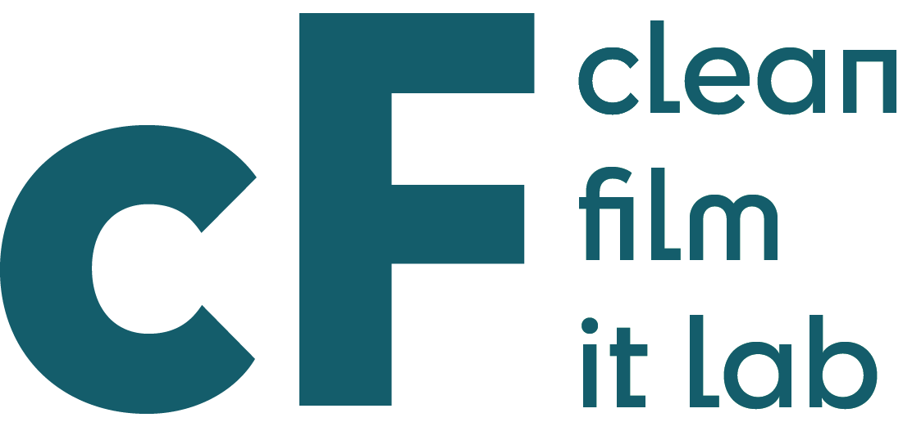
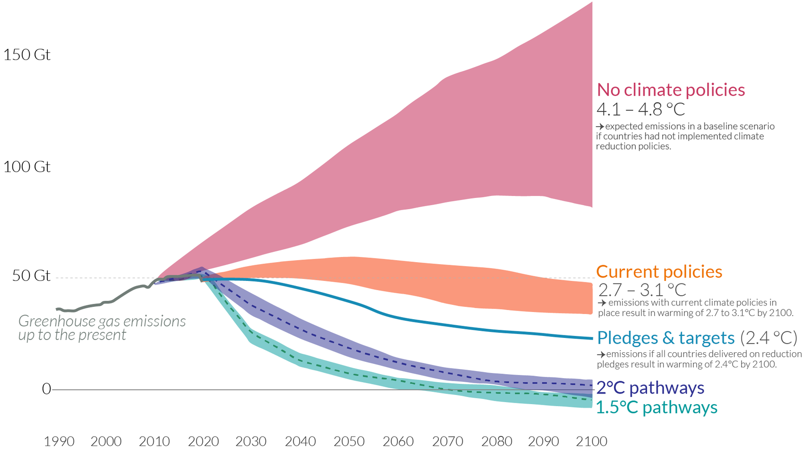

name: inverse
layout: true
class: center, middle, inverse
---

.center[]

.center[]

#### 26.09.2023 | Filmuniversität Babelsberg KONRAD WOLF 
  
  
---
# Teil 1 - Status Quo

---
layout: false

## Agenda

* Begriffsklärung
    * Grün
    * Clean
    * Ökologischer Fußabdruck
    * Co2e Emission
    * Green Washing
* IT & Cloud Komponenten
    * Exemplarisches Studio
    * Exemplarische Bilanzierung
    * Bilanz einer LED Wall
    * Bilanz einer LED Wall
* Aktuelle Probleme
* Aktuelle Lösungsansätze

---
template:inverse

### Status Quo
# *Clean? Green?*

???
.task[COMMENT:]  

... etwas als grün oder clean zu bezeichnen?

Mit grün sind zusammenfassend..

---
.header[Begriffsklärung]

## Green 

* Verfahren oder Produkte mit geringer Umweltbelastung 

.footnote[[European Commission. 2023. [*Green Public Procurement*](https://green-business.ec.europa.eu/green-public-procurement_en). Energy, Climate change, Environment: Green Business.] [Producers Guild of America Foundation. 2023. [*Green Production Guide: Toolkit*](https://greenproductionguide.com/).]]

???
.task[COMMENT:]  

...Verfahren oder Produkte gemeint, die nicht oder nur gering unsere Umwelt, die Natur, das Ökosystem unseres Planeten belasten.

Zu grünen Filmproduktionen, konkretisiert die Producers Guild of America... 

--

> Zu den Prinzipien einer umweltfreundlichen Produktion gehören die Einsparung von Kraftstoff und Energie, die Vermeidung von Giftstoffen und Verschmutzung, die Einsparung von Wasser, die Reduzierung von Plastik und die Vermeidung von Deponieabfällen.

---
.header[Begriffsklärung]

## Ökologischer Fußabdruck 

* *In kurz:* Indikator für ökologische Nachhaltigkeit

> Wie viel Land umd Wasser brauchen wir, um unseren Lebensstil zu ermöglichen?

* Ressourcen für die Produktion, aber auch für z.B. die Entsorgung von Abfällen
* Global verbrauchen wir 1.75 Erden
* Verbrauch ist sehr unterschiedlich verteilt
    * Deutschland 3.25
    * Kongo 0.48

.footnote[[Sustainability Illustrated. 2013. [*Ecological footprint: Do we fit on our planet?*](https://www.youtube.com/watch?v=g_aguo7V0Q4), Global Footprint Network. 2023. [*Ökologischer Fußabdruck*](https://data.footprintnetwork.org/#/countryTrends?cn=79&type=earth)]]

???
.task[COMMENT:]  

Der Begriff clean kommt unter anderem von...

---
.header[Begriffsklärung]

## Clean

* Saubere Energie, insbesondere aus erneuerbaren, nicht-fossilen Energiequellen

.footnote[[Natural Resources Defense Council. 2022. *Renewable Energy: The Clean Facts*. Data, Reports & Resources.]  
[clean-IT Forum. 2023. [*Sustainable Digitalization*](https://open.hpi.de/channels/clean-it-forum).]]

???
.task[COMMENT:]  

...clean Energie unter der man vor allem Energie aus erneuerbaren, nicht-fossilen Energiequellen wie Wind, Sonne, Wasserkraft und Erdwärme versteht.

Clean als Begriff hat sich auch dahingehend weiterentwickelt, ...

-----------------------
* Einige Definitionen erweitern diese Definition um Kraftstoffquellen wie Biokraftstoffe (Ethanol usw.), Wasserstoff und Kernenergie, aber diese sind eher umstritten. Der Begriff wird häufig mit anderen Begriffen wie *emissionsfrei, kohlenstoffneutral, erneuerbar, nachhaltig und klimaneutral* in Verbindung gebracht. Der Begriff "sauber" ist nicht auf die Emission von Kohlenstoff beschränkt, sondern kann auch andere Ressourcen wie Wasser, Abfall und Verschmutzung einschließen [Energie und Wasser - Themen - IEA].
* Erneuerbare Energie, oft auch als [saubere Energie] bezeichnet, stammt aus natürlichen Quellen oder Prozessen, die sich ständig erneuern... Nicht erneuerbare oder "schmutzige" Energie umfasst fossile Brennstoffe wie [Öl, Gas und Kohle]. Nicht-erneuerbare Energiequellen sind nur in begrenzten Mengen verfügbar.
* Clean IT ist ein Projekt der Europäischen Union zur Bekämpfung illegaler Inhalte im Internet. 
--
* IT mit geringem Energieverbrauch

???
.task[COMMENT:]  

... einen geringen Energieverbrauch zu beschreiben. In Kombination mit IT, also Clean IT, versteht man Systeme, die explizit so entwickelt werden, dass sie besonders energiesparend sind. Unsere Kolleg:innen vom HPI haben hier das Prinzip...

--

> Sustainability by Design.

???
.task[COMMENT:]  

...formuliert. 

Neben all diesen Begriffen möchte ich auch uns ein weiteres mal eines der bzw. das Hauptproblem im Kontext von Umweltverschmutzung in Erinnerung rufen.

Unser akutes Problem ist...
  

---
.header[Begriffsklärung]

## Treibhausgasemission

  
[[MIT News]](https://news.mit.edu/2017/explained-greenhouse-gases-0130)

Erderwärmung ist die Folge von Treibhausgasemissionen, sowie nicht-nachhaltiger Forst- und Landwirtschaft.

???
.task[COMMENT:]  

...die Erderwärmung als Folge von vor allem Treibhausgasemissionen.

----------------------------

* 70-20-Müll, 
* Anstieg der Durchschnittstemperatur der erdnahen Atmosphäre und der Meere. 
* Es handelt sich um einen anthropogenen (= menschengemachten) Klimawandel[2]:7, SPM.2, der eine Folge ist von Netto-Treibhausgasemissionen, die seit Beginn der Industrialisierung durch Nutzung von fossilen Energieressourcen sowie nicht-nachhaltiger Forst- und Landwirtschaft entstanden sind
* ein wissenschaftlicher Konsens darüber, dass die gemessene globale Erwärmung nahezu vollständig vom Menschen verursacht wird; Cook et al.: Quantifying the consensus on anthropogenic global warming in the scientific literature. In: Environmental Research Letters. Band 8, 2013, doi:10.1088/1748-9326/8/2/024024
* Kohlenstoff ist in Kohlendioxid enthalten, einem Treibhausgas, das die Wärme in der Nähe der Erde zurückhält. Es hilft der Erde, einen Teil der Wärme, die sie von der Sonne empfängt, zu speichern, damit sie nicht vollständig ins Weltall zurückfließt. Aber CO2 ist nur bis zu einem gewissen Punkt gut - jenseits dieses Punktes erwärmt sich die Erde zu stark. NASA-Forschungssatelliten wie OCO-2 und OCO-3 untersuchen, wie sich Kohlenstoff um den Planeten bewegt. https://climatekids.nasa.gov/carbon/

--

* Nutzung von fossilen Energieressourcen
* Kohlenstoffdioxid (CO2), aber auch andere Treibhausgase

???
.task[COMMENT:]  

Durch die Nutzung fossile Energieressourcen wird Kohlenstoffdioxid (CO2), aber auch andere Treibhausgase, freigesetzt, dass Wärme in der Atmosphäre und der Nähe der Erde zurückhält.

Das ist ein Problem.

------------------

* Wichtigstes Treibhausgas bei der derzeitigen globalen Erwärmung ist Kohlenstoffdioxid (CO2), dazu kommen weitere Treibhausgase wie z. B. Methan und Distickstoffmonoxid. Die von der Messstation Mauna Loa gemessene mittlere CO2-Konzentration in der Erdatmosphäre stieg von ursprünglich etwa 280 ppm vor Beginn der Industrialisierung auf inzwischen über 410 ppm. 
* Das bedeutet, dass CO2 in der Atmosphäre die Wärme in der Nähe der Erde zurückhält. Es hilft unserem Planeten, einen Teil der Wärme, die er von der Sonne erhält, zu speichern, damit die Energie nicht vollständig ins All entweicht.

---
.header[Begriffsklärung | Treibhausgasemission]

## Globale Entwicklung

.center[]

.footnote[[Hannah Ritchie and Max Roser. 2017. *CO₂ and Greenhouse Gas Emissions*. OurWorldInData.org]]

???
.task[COMMENT:]  

Wir wissen alle, aber nichts schaden uns es wieder und wieder vor Augen zu führen. Wenn wir so weiter machen wie bisher, erwärmt sich die Erde um ca. 4 Grad. Wenn wir die aktuellen Pläne umsetzen liegen wir bei eine Erwärmung um die 3 Grad.

Um sich zu verdeutlichen, was das genau bedeutet, nehme ich gerne des Beispiel des Fieber-habens. Stellen Sie sich einfach mal vor, wie es Ihnen wenn sie bei 38 Grad Fieber, bei 39 Grad, bei 40 Grad.  

Unser aktuell noch nicht mal erreichtes Ziel ist es, dauerhaft zwischen 38 und 39 Grad Fieber zu haben.

Diese Erwärmung beruht auf dem Ausstoß von Treibhausgase. Sprich wir müssen dringend weniger Treibhausgase produzieren. Das ist das eines, wenn nicht das Hauptproblem.

Wo stehen wir in diesem Kontext...

--------

* Gigatonnen
* Gesamtbetrag von Kohlenstoffdioxid-Emissionen (CO2-Bilanz, Treibhausgasbilanz, CO2-Fußabdruck)

---
.header[Begriffsklärung | Treibhausgasemissionen]

## Intuitive Quantifizierung

Eine Tonne CO₂

* 0.65 Jahresverbrauch eines durchschnittlichen Haushalts
* 0.5 Jahresverbrauch eines Benziners, 1 Jahresverbrauch eines Elektroautos
* 138 Fleischgerichte, 1961 vegetarische Gerichte
* 1 Flug Paris - New York
* Schaden im Wert von 180 Euro
  
--
  
> Für die Absorption müssen 50 Bäume 1 Jahr wachsen.

.footnote[[Climate Neutral Group. 2023. [*What Exactly Is 1 Tonne of CO₂?*](https://www.climateneutralgroup.com/en/news/what-exactly-is-1-tonne-of-co2-v2/)], Tapio. [*What is a ton of CO₂, and how much CO2 do we emit?*](https://www.tapio.eco/blog/what-represents-one-ton-co2-emissions/), Umweltbundesamt. 2018. [*High costs when environmental protection is neglected*](https://www.umweltbundesamt.de/en/press/pressinformation/high-costs-when-environmental-protection-is)]

???
.task[COMMENT:]  

https://de.globometer.com/kategorie/umwelt

Kugel mit einem Durchmesser von 10 m

A 3,000-mile round-trip flight (like one from Boston to London and back) emits approximately one ton of CO2 per passenger.

U.S. Environmental Protection Agency, Emission Factors for Greenhouse Gas Inventories. Accessed December 2, 2020.

And while it’s nice to know what one ton of carbon looks like, what about 35 billion tons of CO2—roughly the amount the whole human race emits every year?2 35 billion 27’ x 27’ x 27’ cubes would cover 915,224 square miles. This is enough to almost completely cover Alaska and Texas, America’s two largest states. In the continental U.S., it would cover Texas, New Mexico, Arizona, California, Nevada, Utah and a good chunk of Colorado to a depth of 27 feet—and that’s just one year of the world’s CO2 emissions.

https://climate.mit.edu/ask-mit/how-much-ton-carbon-dioxide

Eine Tonne CO₂ ist gleich viel wie...

    3300 Kilometer mit einem Benzinauto
    eine Flugstrecke von Frankfurt nach New York
    8800 Becher Kaffee
    ein Ballon mit neun Metern Durchmesser und rund 380m3 Volumen

Jedes Jahr füllt eine in der Schweiz lebende Person 14 solcher Ballone und verursacht somit rund 14 Tonnen CO₂-Äquivalente pro Jahr (inklusive graue Emissionen). Um den fortschreitenden Klimawandel eindämmen zu können, dürfte dieser Pro-Kopf-Ausstoss höchstens 0,6 Tonnen CO₂ betragen.

https://www.myclimate.org/de-ch/informieren/faq/faq-detail/wie-viel-ist-eine-tonne-co2/

Ziel: eine Tonne CO2 pro Mensch
“In der internationalen Diskussion ist jedoch ein ‘Zwei-Tonnen-Ziel’ – zwei Tonnen CO2-Äquivalent pro Person im Jahr 2050 – als weltweite Zielgröße im Gespräch”, erklärt er.

“Um ein 95-Prozent-Ziel zu realisieren und damit Treibhausgasneutralität herzustellen, wäre für Deutschland eine Pro-Kopf-Emission von einer Tonne pro Jahr in 2050 zu realisieren.” Diese Zahl bezieht sich auf den gesamten Lebensbereich, neben Verkehr auch auf Energie, Konsum und Ernährung.

---
.header[Begriffsklärung | Treibhausgasemissionen]

## CO2-Fußabdruck in Deutschland

.center[]

.footnote[[Bundesministerium für Umwelt, Naturschutz, nukleare Sicherheit und Verbraucherschutz . 2023. [*Kohlenstoffdioxid-Fußabdruck pro Kopf in Deutschland*](https://www.bmuv.de/media/kohlenstoffdioxid-fussabdruck-pro-kopf-in-deutschland)]]

---
.header[Begriffsklärung | Treibhausgasemissionen]

## CO2-Fußabdruck

Fun fact: 

> Allgemeine Bekanntheit erreichte der Begriff carbon footprint durch eine 250 Millionen US-Dollar teure Werbekampagne des Öl- und Gas-Konzerns BP im Jahr 2004 als Versuch, die Wahrnehmung der Verantwortung für die globale Erwärmung von der fossilen Energiewirtschaft hin zum individuellen Verbraucher zu lenken.

.footnote[[Wikipedia. [*CO2-Bilanz*](https://de.wikipedia.org/wiki/CO2-Bilanz#cite_note-:3-3)]]

---
.header[Begriffsklärung]

## CO2-Fußabdruck

> Wir benutzen grünen Strom - es ist also alles gut!

--
  
* Rohstoffe
* Verschmutzung 
* Abfälle

--

### Emissionen der Herstellungs- und Entsorgungsprozesse?!

* Rechenzentren Nutzungsphase 80 %
* IT-Produkten für Endkonsumenten Herstellungsphase 75 - 98 %

.footnote[[Jens Gröger. 2022. [*Was ist Green IT?*](https://www.oeko.de/publikationen/p-details/was-ist-green-it). International Energy Agency.]]

---
.header[Begriffsklärung | Treibhausgasemissionen]

## Beispiel Elektroautos

.todo[TODO:]

* US: 1/5 aller Emissionen durch Autos
* Lebensdauer 15 - 20 Jahre -> Zustand bis 2040 wird jetzt festgelegt

> Elektroautos sind im Vergleich ökologisch nachhaltiger als Benziner

* Woher kommt der Strom für den Betrieb?
    * Ca. 1/3 weniger Emissionen
* Herstellung der Batterien
    * Rohstoffe
    *  Ca. 3/4 mehr Emissionen

.footnote[[David Keith und Aaron Krol. 2023. [*Electric Vehicles*](https://climate.mit.edu/explainers/electric-vehicles). MIT Climate Portal.]]

--
> Besser: kein Autofahren!

---
.header[Begriffsklärung]

## Green Washing

.todo[TODO:]
Nachhaltigkeit als Verkaufsargument.

* Schwer überprüfbar
* Keine Standards, fehlende rechtlich bindende Definitionen
    * Bilder und Symbole, Begriff und Rhetorik
    * Werbung mit Selbstverständlichkeit
* CO2-Kompensation

.footnote[[Annika Witzel. 2019. [*Darum ist Greenwashing ein Problem*](https://www.quarks.de/umwelt/klimawandel/darum-ist-greenwashing-ein-problem/). Quarks., Jan Tolzmann. 2021. [*Wie sinnvoll ist die freiwillige CO2-Kompensation?*](https://www.quarks.de/umwelt/klimawandel/das-bringt-es-co2-emissionen-zu-kompensieren/). Quarks.]]

???
.task[COMMENT:]  

* Bsp Wenn beispielsweise ein Hersteller damit wirbt, dass die Produkte „regional“ sind, kann er das problemlos tun, ohne zu klären was „regional“ oder „von hier“ eigentlich bedeutet. Es gibt keine rechtlich bindende Definition, wo Regionalität anfängt und – vor allem – wo sie aufhört. Ebenso verhält es sich mit Worten wie „klimafreundlich“ oder „umweltschonend“. Diese Begriffe sind auch weder genau definiert, noch geschützt.

--
  
> Als Verbraucher:innen müssen wir noch aufmerksamer sein, als Unternehmen tatsächlich nachhaltig!
  

???
.task[COMMENT:]  

   NABU-Siegel-Check: Erste App mit Fotoerkennung von Lebensmittellogos

---
template:inverse

### Status Quo - *Clean? Green?*

## Diskussion

???
.task[COMMENT:]  

* Andere Meinungen?
* Fehlt etwas?
* Welche anderen Faktoren brauchen wir?

---
template:inverse

### Status Quo
# IT & Cloud Komponenten

---
.header[IT & Cloud Komponenten]

## Exemplarisches Studio Setup

.todo[TODO:]

Mit

* Computerarbeitsplätze und Servers
* Bildschirme and Displays
* Speicher, Cloud Storage
* Cloud Computing
* Survey: Router, LED-Leuchte, Handys, DSLR Kamera, 4K DCI Projektor Mischpulte

Einblicke, welche Techniken schon erprobt sind und sich gut umsetzen ließen, z. B. Nutzung von Abwärme.

---
.header[IT & Cloud Komponenten | Exemplarisches Studio Setup]

## Bilanzierung

.todo[TODO:]

Welche Elemente haben welche Auswirkungen?

---
.header[IT & Cloud Komponenten]

## Bilanz einer LED Wall

---
.header[IT & Cloud Komponenten]

## Bilanz eines Filmsets

---
template:inverse

### Status Quo
# Aktuelle Probleme?

## Diskussion

---
template:inverse

### Status Quo
# Aktuelle Lösungsansätze

---
## Aktuelle Lösungsansätze

.todo[TODO:]

* Nutzung von Abwärme?

*Keine Ahnung was man hier listen könnte...*

---
template:inverse

### Teil 2
# Trends & Ausblick

## mit Jens Gröger

---
template:inverse

### Teil 3
# Die Nächsten Schritte

